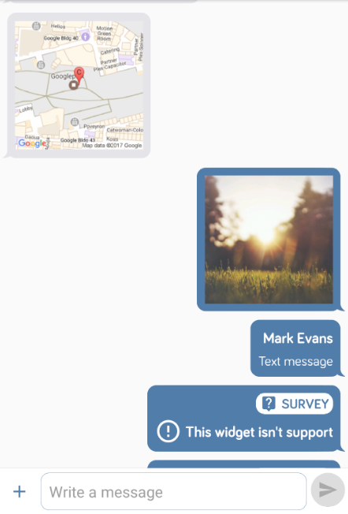
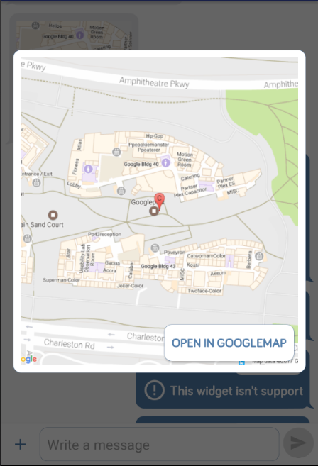
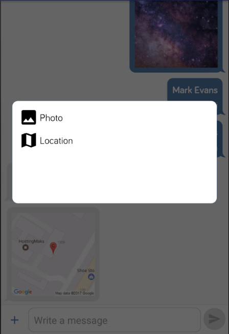

# Widget concept


## Common principles

### Registration

Widget concept allow to create user interface independently from the **API** calls due **```KitWdgetManager```** registration. 

**Code 1:** *Example of the widget registration* in the Application singleton

```java
/**
 * Method which provide the registering of the widgets for the current {@link Application}
 */
@Override
protected void registerWidgets() {
 //Register the message with type - text
 KitWidgetManager.register(new KitCreatorMessageText());
 //Register the message with type - location
 KitWidgetManager.register(new KitCreatorMessageLocation());
 //Register the message with type - photo
 KitWidgetManager.register(new KitCreatorMessagePhoto());
}
```

### View representations

Widget object contain of the 3 types of the view representations:

* **```Create```** widget view;
* **```Details```** widget view;
* **```List```** widget view.

**```Create```** and **```Details```** widget view can be **```@Nullable```**, **```List```** can't be **```@Nullable```**. If developer isn't implement the **```List```** representation in this case **```KitWidgetManager```** return the object for unsupported widget.

**Image 1:** *List representation of the Widget*



**Image 2:**  *Details representation of the Widget*



### Define

Widget have the **```List```** of the definers that allow to check if **```Object```** which received from the API is the kind of widget. For implementation of the definer developer should extend of the **```KitBaseDefiner```**. Definer register for the class which should be putting inside the definer itself.

**Code 2:** *Example of the definer for the ```MMXMessage``` for the location message type*

```java
public final class KitDefinerMessageLocation extends KitBaseDefiner {

 /**
  * Default constructor for the {@link KitBaseDefiner}
  *
  * @param callerClass instance of the {@link Class}
  */
 public KitDefinerMessageLocation(@NonNull Class callerClass) {
  super(callerClass);
 }

 /**
  * Method which provide the define functional for the {@link Object}
  *
  * @param object instance of the {@link Object}
  */
 @Nullable
 @Override
 public String define(@Nullable Object object) {
  if ((object != null) && (object instanceof MMXMessage)) {
   final MMXMessage message = (MMXMessage) object;
   if (message != null) {
    final KitMessageType type = KitMessageHelper.getType(message);
    if (type == KitMessageType.MAP) {
     return KitWidgetType.MESSAGE_LOCATION.getValue();
    }
   }
  }
  return null;
 }
}
```

**Code 3:** *Example of the constructor for the ```KitDefinerMessageLocation```*

```java
/**
 * Method which provide the getting of the {@link List} of the {@link KitBaseDefiner}
 *
 * @return {@link List} of the {@link KitBaseDefiner}
 */
@Nullable
@Override
public List < KitBaseDefiner > getDefiners() {
 return Arrays.asList(
  new KitBaseDefiner[] {
   new KitDefinerMessageLocation(MMXMessage.class)
  }
 );
}
```

### Menu items

Widget provide the menu items for create itself. They registering inside the widget, and should be connected to view which will be call them.

**Image 3:** *Menu items*



If widget have **```View```** representation for the **```Create```** itself in this case when user press in menu item, it would see the **```Create view```**, in other case application receive the event in the view (**```OnKitViewCallback -> onMenuItemClick(@NonNull KitMenuModel object)```**).  **```List```** of the **```KitMenuModel```** can be **```@Nullable```**. In this case **```Widget```** won't have of the menu items.

**Code 4:** *Example of the **```KitMenuModel```** creation*

```java
/**
 * Method which provide the getting of headers for the menu of the create of the widget
 *
 * @return {@link String} value of the menu header
 */
@Nullable
@Override
public List < KitMenuModel > getMenuHeaders() {
 return Arrays.asList(
  new KitMenuModel(KitMessageType.PHOTO.getText(),
   KitMessageType.PHOTO.getIcon(),
   KitWidgetMessagePhoto.class,
   KitChatView.class,
   KitWidgetType.MESSAGE_PHOTO.getValue())
 );
}
```

### Widget 

For widget implementation developer need to extend of the **```KitWidgetModel<T>```** and override every required methods.

**Code 5:** *Prototype for the widget*

```java
//==============================================================================================
//                                     VIEWS
//==============================================================================================

/**
 * Method which provide the getting view for create widget
 *
 * @param context instance of {@link Context}
 * @return instance of the {@link BSView}
 */
@Nullable
KitBaseCreateView getViewCreate(@NonNull Context context);

/**
 * Method which provide the checking if widget need to have of the create view
 *
 * @return checking if widget need to have of the create view
 */
boolean isNeedCreateView();

/**
 * Method which provide the getting view for details
 *
 * @param context instance of {@link Context}
 * @return instance of the {@link BSView}
 */
@Nullable
KitBaseDetailsView getViewDetails(@NonNull Context context, @Nullable final Parcelable object);

/**
 * Method which provide the checking if widget need to have of the details view
 *
 * @return checking if widget need to have of the create view
 */
boolean isNeedDetailsView();

/**
 * Method which provide the getting view for list representation
 *
 * @return instance of the {@link BSView}
 */
@Nullable
KitBaseListObject getViewList(@Nullable final Parcelable object);

//==============================================================================================
//                                CREATION MENU HEADER
//==============================================================================================

/**
 * Method which provide the getting of headers for the menu of the create of the widget
 *
 * @return {@link String} value of the menu header
 */
@Nullable
List < KitMenuModel > getMenuHeaders();

/**
 * Method which provide the checking if widget is need of the menu headers
 *
 * @return checking if widget is need of the menu headers
 */
boolean isNeedHeaders();

/**
 * Method which provide the getting of the {@link List} of the {@link KitBaseDefiner}
 *
 * @return {@link List} of the {@link KitBaseDefiner}
 */
@Nullable
List < KitBaseDefiner > getDefiners();

/**
 * Method which provide the getting of the menu header
 *
 * @return checking result
 */
boolean isNeedMenuHeader();

/**
 * Method which provide the getting of the instance of {@link Object}
 *
 * @return instance of {@link Object}
 */
@Nullable
T getObject();

/**
 * Method which provide the getting of the priority for the widget
 *
 * @return instance of the {@link KitWidgetPriority}
 */
@NonNull
KitWidgetPriority getPriority();
```

###  List view

For implementation of the **```List```** view developer should extend of the **```KitBaseListObject<T>```** and override every required methods.

**Code 6:** *Prototype for the list view*

```java
    /**
     * Method which provide the performing the action when the {@link Parcelable} was set
     *
     * @param object instance of the {@link Object}
     */
    public abstract void onPerformInitialize(@Nullable final T object);

    /**
     * Method which provide the getting of the instance of the {@link ClassLoader}
     *
     * @return instance of the {@link ClassLoader}
     */
    @NonNull
    protected abstract ClassLoader getClassLoader();

	/**
     * Method which provide the getting of the instance of the {@link BaseRecyclerItem}
     *
     * @param context instance of the {@link Context}
     * @return instance of the {@link BaseRecyclerItem}
     */
    @Override
    public abstract BaseRecyclerItem getRecyclerItem(@NonNull Context context);
```

For list representation of the **Widget** developer need to extends of the **```BaseRecyclerItem```** and override it required methods.

### Details view

For implementation of the **```Details```** view developer should extend of the **```KitBaseDetailsView<T>```** and override every required methods.

**Code 7:** *Prototype for the details view*

```java
/**
 * Method which provide the getting of the {@link Integer} value of the layout ID
 *
 * @return {@link Integer} value of the layout ID
 */
@Override
protected abstract int getLayoutId();

/**
 * Method which provide the functional after {@link View} creation
 */
@Override
protected abstract void onCreateView();
```

### Create view

For implementation of the **```Create```** view developer should extend of the **```KitBaseCreateView<T>```** and override every required methods.

**Code 8:** *Prototype for the create view*

```java
/**
 * Method which provide the getting of the {@link Integer} value of the layout ID
 *
 * @return {@link Integer} value of the layout ID
 */
@Override
protected abstract int getLayoutId();

/**
 * Method which provide the functional after {@link View} creation
 */
@Override
protected abstract void onCreateView();
```


## How To

### Application singleton

Create the **```Application```** singleton by extending of the **```KitApplication```** and override of the methods. Use the **```KitApplication -> registerWidgets()```** method for the widget registration.

**Code 9:** *Example of the method for the registration of the widgets*

```java
/**
 * Method which provide the registering of the widgets for the current {@link Application}
 */
@Override
protected void registerWidgets() {
 //TODO Register widgets here
}
```

### Chat view

For current implementation of the **ChatKit** exists the **```KitChatView```** which allow to get the **```MMXMessage```** for the instance of the **```MMXChannel```**. 

**Code 10:** *Example how to use of the ```KitChatView```*

```java
public final class DetailsActivity extends BSActivity {

 /**
  * Instance of the {@link ChannelDetail}
  */
 private ChannelDetail channel;

 /**
  * Instance of the {@link KitChatView}
  */
 @FindViewBy(id = R.id.view_chat)
 private KitChatView chatView;

 /**
  * Method which provide the getting of the layout ID for the current Activity
  *
  * @return layout ID for the current Activity
  */
 @Override
 protected int getLayoutId() {
  return R.layout.activity_details;
 }

 /**
  * Method which provide the action when Activity is created
  *
  * @param bundle instance of {@link Bundle}
  */
 @Override
 protected void onCreateActivity(@Nullable Bundle bundle) {
  setTitle("Conversation details");
  channel = //Get channel here
  chatView.setChannel(channel);
  chatView.setOnViewCallback(viewCallback);
 }

 /**
  * Method which provide the action when the view is destroy
  */
 @Override
 protected void onDestroy() {
  chatView.onDestroyView();
  super.onDestroy();
 }

 //==============================================================================================
 //                                      CALLBACKS
 //==============================================================================================

 /**
  * Instance of the {@link OnKitViewCallback}
  */
 private final OnKitViewCallback viewCallback = new OnKitViewCallback() {
  /**
   * Method which provide the action when {@link BSView.Event} received
   *
   * @param context instance of {@link Context}
   * @param view    instance of the {@link BSView}
   * @param event   instance of the {@link BSView.Event}
   */
  @Override
  public void onCreateEventReceived(@NonNull Context context,
   @NonNull BSView view,
   @NonNull BSView.Event event) {

  }

  /**
   * Method which provide the action when user press on the channel object
   *
   * @param index  current index
   * @param object current object
   */
  @Override
  public void onItemClick(int index,
   @NonNull KitBaseListObject object) {

  }

  /**
   * Method which provide the action when user doing the long press on item
   *
   * @param index  index
   * @param object object
   */
  @Override
  public void onItemLongClick(int index,
   @NonNull KitBaseListObject object) {

  }

  /**
   * Method which provide the action listening
   *
   * @param recycleEvent event
   * @param index        index
   * @param object       object
   */
  @Override
  public void onActionReceived(@NonNull RecycleEvent recycleEvent,
   int index,
   @NonNull KitBaseListObject object) {

  }

  /**
   * Method which provide the action when menu item was press
   *
   * @param object instance of the {@link KitMenuModel}
   */
  @Override
  public void onMenuItemClick(@NonNull KitMenuModel object) {
   
  }
 };
}
```

### Universal views

For current implementation of the **ChatKit** exists the **```KitUniversalWidgetView```** which provide the setting of the **```List```** of the **```KitBaseListObject```** which provide the set everything that developer receive from the server side and convert to the **```KitBaseListObject```**.

**Code 11:** *Example how to use of the ```KitUniversalWidgetView```*

```java
public final class UniversalViewActivity extends BSActivity {

    /**
     * Instance of the {@link KitUniversalWidgetView}
     */
    @FindViewBy(id = R.id.view_universal)
    private KitUniversalWidgetView widgetView;

    /**
     * Method which provide the getting of the layout ID for the current Activity
     *
     * @return layout ID for the current Activity
     */
    @Override
    protected int getLayoutId() {
        return R.layout.activity_universal;
    }

    /**
     * Method which provide the action when Activity is created
     *
     * @param bundle instance of the {@link Bundle}
     */
    @Override
    protected void onCreateActivity(@Nullable Bundle bundle) {
        setTitle(getString(R.string.text_universal));
        this.widgetView = (KitUniversalWidgetView) findViewById(R.id.view_universal);
        this.widgetView.showProgress();
        final List<KitBaseListObject> objects = new ArrayList<>();
        BSThreadManager.background(new BSThreadManager.OnThreadCallback() {
            @Override
            public void onExecute() {
                for (int i = 0; i < 100; i++) {
                    final LabelObject object = new LabelObject();
                    final KitBaseListObject listObject = new ListObjectLabel(object);
                    objects.add(listObject);
                }
                widgetView.setItems(objects);
                widgetView.hideProgress();
            }
        });
    }
}
```

## Summary

In general for now developer able to use **```KitUniversalWidgetView```** and **```KitChatView```** for implementation of the widget functional.  **```KitChatView```** have it own **```Presenter```** for data receiving from the server side and developer able to add it own (custom) widget for the **```KitChatView```** by registering it in the **```Application```** singleton.